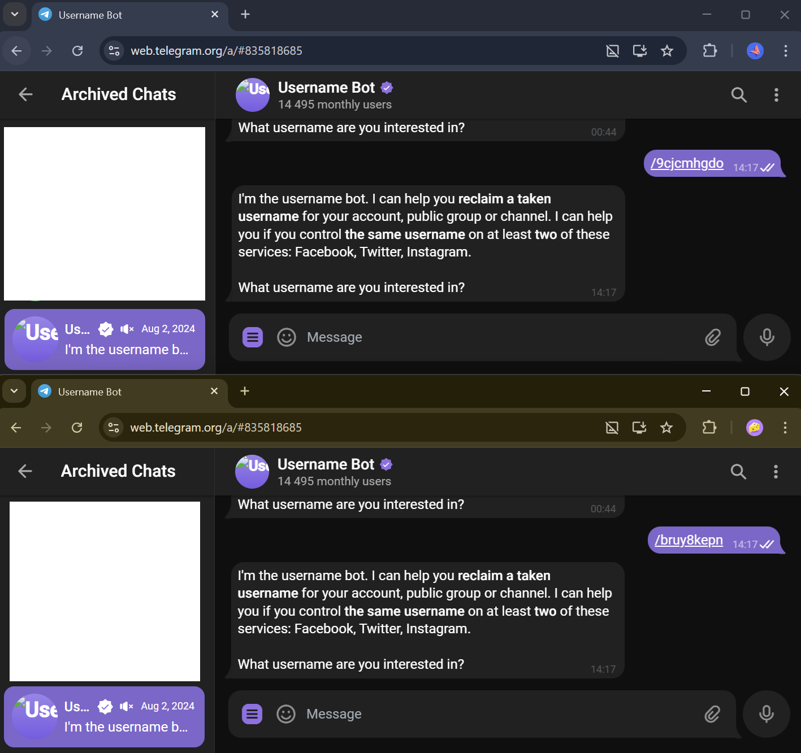
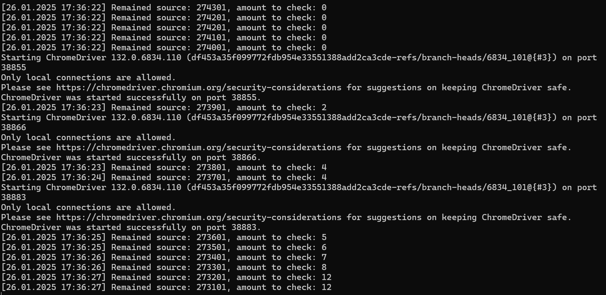
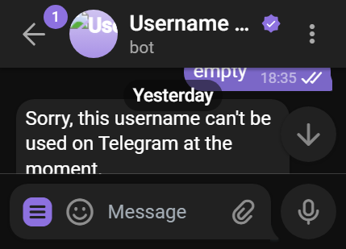

# TelegramUsernameFinder







## Overview

**TelegramUsernameFinder** is a robust tool designed to automate the process of finding, reserving, and selling available Telegram usernames on the Fragment platform.
By leveraging Selenium for web automation and integrating with the efficient [Username Bot](https://t.me/username_bot), this tool accelerates the username acquisition process while bypassing common restrictions.
It supports multithreading and multiple accounts, ensuring high performance and scalability. All results are securely stored in a MongoDB database for easy access and management.

## Features

- **Automated Username Searching**: Iterates through a predefined dictionary of usernames to identify available ones on Telegram.
- **Selenium Integration**: Utilizes Selenium WebDriver for seamless interaction with the Telegram web interface.
- **Get Username Bot Integration**: Enhances speed and bypasses Telegram's restrictions by using the Get Username Bot.
- **Multithreading Support**: Employs producer-consumer patterns to handle multiple threads and accounts simultaneously.
- **Multiple Account Management**: Supports the use of several Telegram accounts to maximize the search efficiency.
- **MongoDB Integration**: Stores all found usernames and related data in a MongoDB database for persistent storage and easy retrieval.
- **Scalable Architecture**: Designed to handle large dictionaries and high-volume searches with ease.

## How It Works

1. **Load Username Dictionary**: The tool loads a list of potential usernames from a predefined dictionary.
2. **Automated Checking**: Using Selenium, it navigates the Telegram web interface and interacts with the Get Username Bot to check the availability of each username.
3. **Multithreaded Processing**: Multiple threads and accounts work in parallel to speed up the searching process.
4. **Result Storage**: Available usernames are saved to a MongoDB database for further action, such as reserving or selling on Fragment.
5. **Continuous Operation**: The tool continuously monitors and updates the database with newly available usernames.

## Project Structure

- **UsernameCheckers/**: Contains classes responsible for interacting with Telegram to check username availability.
- **ThreadWorkers/**: Implements the producer-consumer pattern for multithreaded processing.
- **Helpers/**: Utility classes and helper functions.
- **Repositories/**: Handles interactions with the MongoDB database.
- **Resources/**: Contains image assets and other resources used in the project.
- **Interfaces/**: Defines interfaces for various components to ensure modularity and ease of testing.
- **Program.cs**: Entry point of the application.
- **TelegramUsernameFinder.sln**: Solution file for the project.
- **LICENSE**: Licensing information.

## Releases

Stable and pre-release versions are available on the [GitHub Releases Page](https://github.com/ButterDevelop/TelegramUsernameFinder/releases).
Download the latest version to get started quickly.

## Contributing

Contributions are welcome! Whether you're reporting bugs, suggesting features, or submitting pull requests, your support helps improve the project. Please follow these steps to contribute:

1. **Fork the Repository**
2. **Create a Feature Branch**

   ```bash
   git checkout -b feature/YourFeature
   ```
3. **Commit Your Changes**

   ```bash
   git commit -m "Add Your Feature"
   ```
4. **Push to the Branch**

   ```bash
   git push origin feature/YourFeature
   ```
5. **Open a Pull Request**

Please ensure your code follows the project's coding standards and includes relevant tests.

## License

This project is licensed under the MIT License. You are free to use, modify, and distribute this software as per the license terms.

## Contact

For any questions, suggestions, or feedback, please reach out to me on GitHub.